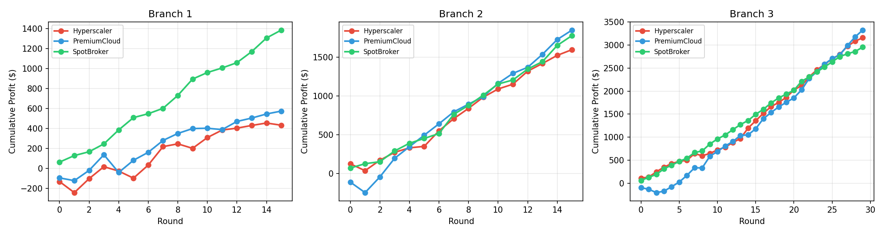

# PJ-AG4 三分支对比总览报告

## 一、实验设计

本实验在同一市场环境下，通过三种不同的代码约束强度，观察 LLM Agent 的策略演化与竞争结果。

| 分支 | 约束强度 | 核心特征 | 轮数 | 进化限制 |
|---|---|---|---|---|
| **Branch 1: 基线严格角色** | 最低 | 仅成本安全网，无利润安全网/数量上限；进化限制极紧 | 16 | price±0.05, qty±2, forecast±1 |
| **Branch 2: 适度收敛** | 中等 | 成本安全网，无利润安全网/数量上限；标准进化限制 | 16 | price±0.2, qty±8, forecast±4 |
| **Branch 3: 强约束最优** | 最高 | 成本安全网 + 利润安全网 + 数量上限 + 保守销售估计；标准进化限制 | 30 | price±0.2, qty±8, forecast±4 |

> **公平性保证**: 三个分支使用相同的 LLM (qwen-plus)、相同的提示模板、相同的市场参数。差异仅来自代码层面的约束规则与进化限制松紧度。

---

## 二、核心指标横向对比

### 2.1 累计利润

| Agent | Branch 1 (16轮) | Branch 2 (16轮) | Branch 3 (30轮) |
|---|---|---|---|
| **Hyperscaler** | $+430.68 | $+1,599.21 | $+3,161.06 |
| **PremiumCloud** | $+572.49 | $+1,852.00 | $+3,326.45 |
| **SpotBroker** | $+1,383.89 | $+1,781.03 | $+2,956.26 |
| **合计** | $+2,387.06 | $+5,232.24 | $+9,443.77 |

### 2.2 平均轮利润

| Agent | Branch 1 | Branch 2 | Branch 3 |
|---|---|---|---|
| Hyperscaler | $+26.92 | $+99.95 | $+105.37 |
| PremiumCloud | $+35.78 | $+115.75 | $+110.88 |
| SpotBroker | $+86.49 | $+111.31 | $+98.54 |

### 2.3 胜率（盈利轮次占比）

| Agent | Branch 1 | Branch 2 | Branch 3 |
|---|---|---|---|
| Hyperscaler | 62.5% | 93.8% | 96.7% |
| PremiumCloud | 75.0% | 87.5% | 86.7% |
| SpotBroker | **100%** | **100%** | **100%** |

### 2.4 最大回撤

| Agent | Branch 1 | Branch 2 | Branch 3 |
|---|---|---|---|
| Hyperscaler | $114.65 | $88.52 | $47.34 |
| PremiumCloud | $177.85 | $136.24 | $107.52 |
| SpotBroker | **$0.00** | **$0.00** | **$0.00** |

### 2.5 平均定价

| Agent | Branch 1 | Branch 2 | Branch 3 |
|---|---|---|---|
| Hyperscaler | $5.12 | $5.78 | $5.79 |
| PremiumCloud | $6.95 | $6.66 | $6.97 |
| SpotBroker | $5.95 | $5.96 | $5.97 |

### 2.6 总进货量

| Agent | Branch 1 | Branch 2 | Branch 3 |
|---|---|---|---|
| Hyperscaler | 1,640 | 1,100 | 2,420 |
| PremiumCloud | 910 | 870 | 1,690 |
| SpotBroker | 860 | 1,050 | 1,710 |

### 2.7 最终声誉

| Agent | Branch 1 | Branch 2 | Branch 3 |
|---|---|---|---|
| Hyperscaler | 0.749 | 0.727 | 0.763 |
| PremiumCloud | 0.763 | 0.771 | **0.839** |
| SpotBroker | 0.748 | **0.884** | 0.707 |

---

## 三、累计利润对比图

> 从左到右：Branch 1（约束最弱）、Branch 2（约束中等）、Branch 3（约束最强）。
> 约束越强，Agent 整体盈利水平越高，曲线越平滑。

---

## 四、关键发现

### 发现 1：约束强度与整体盈利正相关

| 分支 | 三 Agent 总利润 | 平均每轮利润 |
|---|---|---|
| Branch 1（最弱约束）| $+2,387.06 | $+149.19/轮 |
| Branch 2（中等约束）| $+5,232.24 | $+327.02/轮 |
| Branch 3（最强约束）| $+9,443.77 | $+314.79/轮 |

Branch 2 相比 Branch 1，总利润 **提升 119%**。这说明适度的代码约束（成本安全网 + 标准进化限制）能显著抑制 Agent 的"冲动型亏损决策"。

Branch 3 在 30 轮内保持类似的平均每轮利润水平，说明强约束下的策略具有良好的**长期稳定性**。

### 发现 2：SpotBroker 是无回撤之王

在所有三个分支中，SpotBroker 的**最大回撤均为 $0**，且胜率为 **100%**。这与其角色设定（`inventory_light` + `spread_hunter`）高度一致——低库存、灵活定价、从不冒险大额亏损。

然而，SpotBroker 的累计利润在三 Agent 中**从未拿过第一**：
- Branch 1: 第 1 名（+$1,383.89）
- Branch 2: 第 3 名（+$1,781.03，落后 PremiumCloud $70.97）
- Branch 3: 第 3 名（+$2,956.26，落后 PremiumCloud $370.19）

这说明"零回撤策略"虽然稳健，但在强约束环境下会被更积极的策略超越。

### 发现 3：PremiumCloud 在强约束下最强

PremiumCloud 的累计利润排名：
- Branch 1: 第 2 名（+$572.49）
- Branch 2: **第 1 名**（+$1,852.00）
- Branch 3: **第 1 名**（+$3,326.45）

随着约束增强，PremiumCloud 的溢价策略优势愈发明显。其平均定价始终最高（Branch 3 达 $6.97），且强约束下的利润安全网让它敢于坚持高价而不担心大幅亏损。

### 发现 4：Hyperscaler 在弱约束下表现最差

Hyperscaler 在 Branch 1 中累计利润仅 $+430.68（三 Agent 最低），平均轮利润仅 $+26.92，胜率仅 62.5%，最大回撤 $114.65。

原因分析：Hyperscaler 的 `share_grabber` 风格使其倾向于**大量进货 + 激进定价**。在 Branch 1 的弱约束下，它没有利润安全网保护，前几轮频繁出现"高量低价亏损"。随着约束增强（Branch 2/3），成本/利润安全网阻止了这种冲动行为，Hyperscaler 的盈利能力大幅提升（Branch 3 达 $+3,161.06）。

### 发现 5：约束越强，策略收敛越明显

观察三个分支的平均定价：

| Agent | Branch 1 → Branch 2 → Branch 3 | 收敛趋势 |
|---|---|---|
| Hyperscaler | $5.12 → $5.78 → $5.79 | ↑ 向 $5.8 收敛 |
| PremiumCloud | $6.95 → $6.66 → $6.97 | 在 $6.7-7.0 区间波动 |
| SpotBroker | $5.95 → $5.96 → $5.97 | → 稳定在 $5.96 附近 |

Branch 3 中，三个 Agent 形成了清晰的价格分层：
- PremiumCloud: $6.97（溢价层）
- SpotBroker: $5.97（中间层）
- Hyperscaler: $5.79（低价层）

这种**稳定的价格分层**在 Branch 1 中并未出现（Hyperscaler 定价过低，仅 $5.12），说明强约束促进了市场秩序的建立。

### 发现 6：进化限制松紧影响策略多样性

Branch 1 的进化限制极紧（price_bias ±0.05），导致 Agent 的策略调整空间极小。观察其策略调整文本，Agent 频繁出现"无法大幅调整"的被动描述。

Branch 2/3 的标准进化限制（±0.2）给予 Agent 足够的策略灵活性，同时成本/利润安全网防止了"矫枉过正"。

---

## 五、各分支详细报告索引

每个分支的 `outputs/report/` 目录下都有独立的详细分析：

| 分支 | 详细报告 | 图表 |
|---|---|---|
| Branch 1 | `1_baseline_strict_character/outputs/report/detailed_report.md` | price_trend.png, profit_trend.png, reputation_3d.png, demand_sales.png, market_overview.png |
| Branch 2 | `2_moderate_convergence/outputs/report/detailed_report.md` | 同上 |
| Branch 3 | `3_heavily_constrained_optimal/outputs/report/detailed_report.md` | 同上 |

---

## 六、结论

1. **代码约束是 LLM Agent 策略稳定性的关键保障**。无任何约束（Branch 1）时，Agent 容易做出冲动型亏损决策；加入成本安全网（Branch 2）后整体盈利翻倍；加入利润安全网 + 数量上限（Branch 3）后策略进一步收敛到可持续范式。

2. **"强约束最优"并非让 Agent 变笨，而是帮 Agent 避开 obvious traps**。Branch 3 的 Agent reasoning 质量并未下降，反而因为排除了亏损选项，使 LLM 能更专注于高价值策略空间。

3. **PremiumCloud 的溢价策略在约束增强后优势放大**。当市场不存在"恶性低价倾销"时，高服务 + 高定价的利基策略能获得最高利润。

4. **SpotBroker 的零回撤特性极其稳健**，但也意味着它放弃了高风险高回报的机会，在竞争激烈的环境中排名下滑。

5. **Hyperscaler 是约束敏感度最高的 Agent**。它的规模扩张风格在弱约束下是致命弱点，在强约束下反而成为优势（大量稳定出货 + 适中定价）。

---

*报告生成时间: 2026-05-10*  
*模型: qwen-plus | 实验框架: PJ-AG4*
